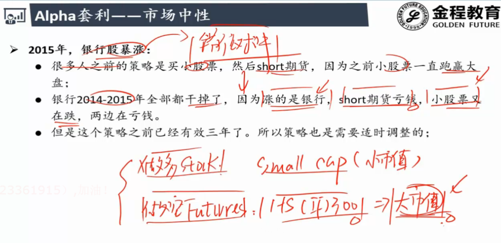
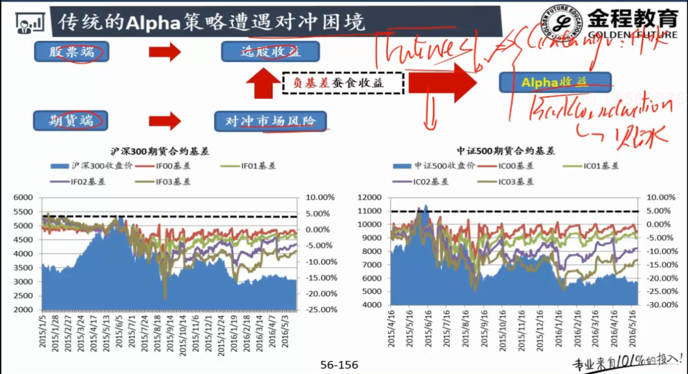
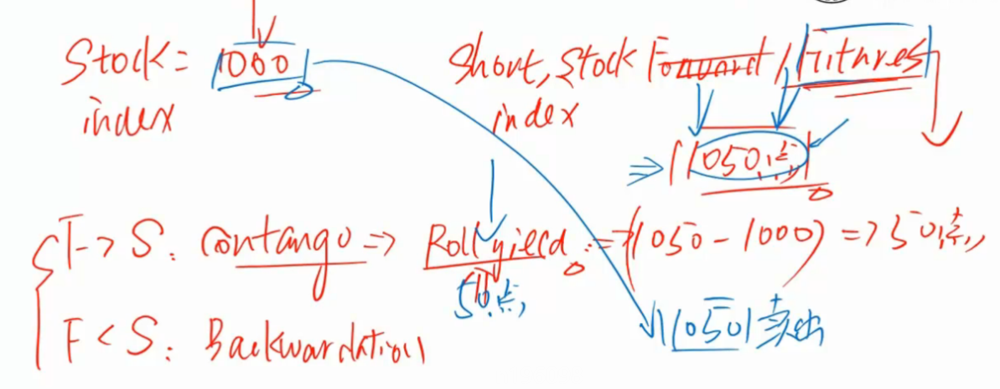
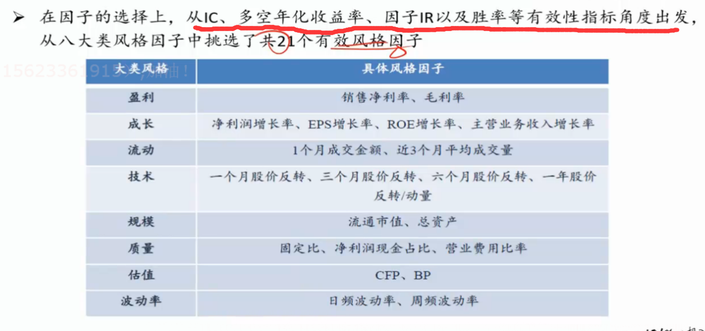
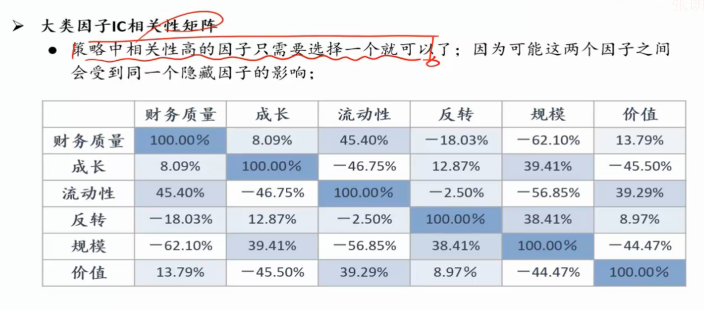
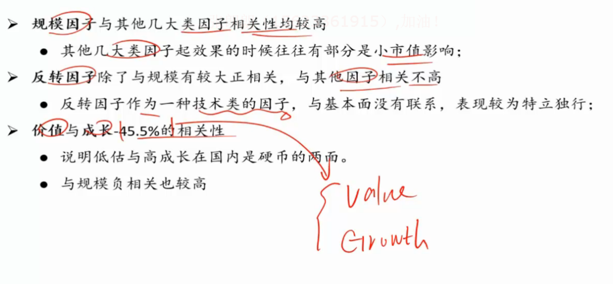
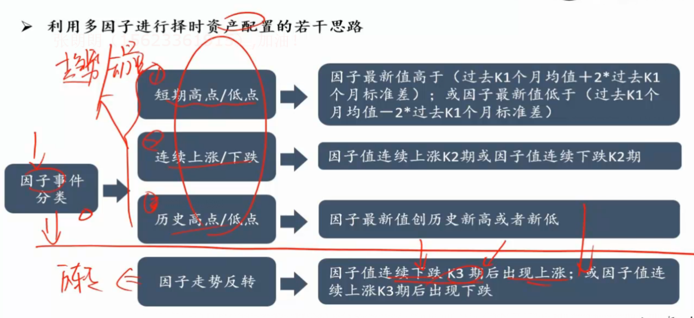
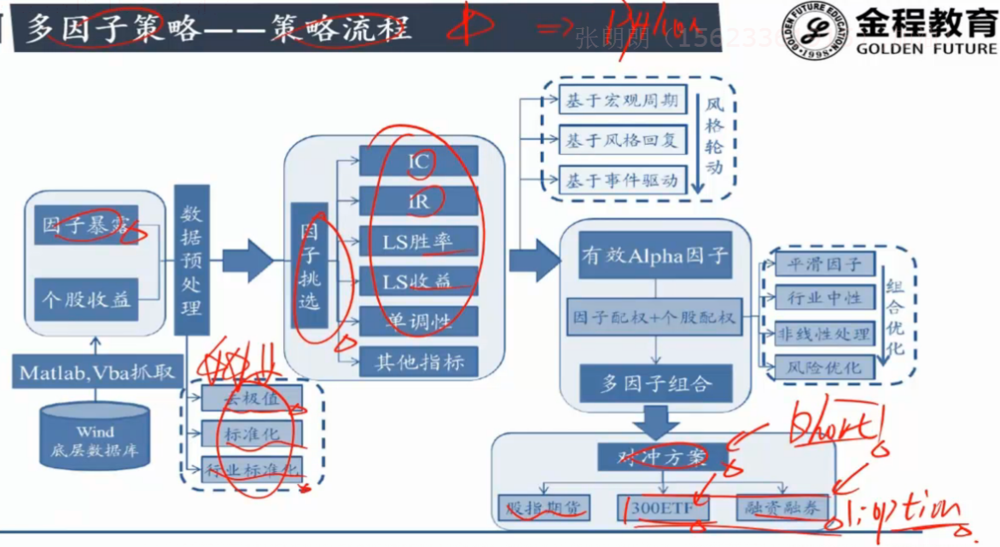

# 市场中性alpha策略

- 做多自己挑选出来的股票
- 做空股指期货

- 通过选择表现好的因子,就算跌也比大盘跌得少
- 一样能获得alpha

## 两个问题

### 1.本质:错位对冲

- 买的股票跌
- 大盘又在涨
- 两边亏钱

### 2.负基差蚕食alpha收益

- 做空股指期货时 , backwardation情况下roll-yield是负的
- 增加了对冲成本

> 不同期限结构的roll-yield

- contango
  - 当你做空的那一刻就获得了50点的滚动收益

- backwardation
  - 做空就发生损失,增加了成本

# 多因子策略

## 原理

- 关键 : 什么样的因子是**有效因子**?
- 做多挣钱了并不能说明就是一个好因子
  - 收益排名前面的显著跑赢大盘
  - 收益排名后面的显著跑输大盘
  - 两边赚钱,这样的因子才是好因子

## 模型发展

## 一般流程

### 数据预处理

### 单因子检验

### 因子相关性

### 打分法选股

排序打分:

### 对冲方案

## 因子权重

- 最简单 : 等权重

- 高级 : 风险平价 

  - 不同的因子会有不同的风险贡献
  - 让因子怎么去配比
  - 让每个因子对风险的贡献程度都一样

### 风险平价

## 一致预期问题

- 大家都知道某个因子好

- 行情好的时候可以
- 一旦行情下跌 , 股票很难卖出去,找不到对手方

## 因子分类

## **==表现较好的因子:==**

## 去除冗余因子

## 实例及优化

- 流动比率 : 流动资产除以流动负债
  - 太低说明流动性低
  - 衡量短期偿债能力
- 6个因子给与相应权重选出得分最高的股票

## 因子择时

## 因子失效

**设定监控机制**

## 整体交易框架

## 策略详细流程

### 数据预处理

- 去极值:

  - 使用3倍标准差

  

- 标准化:
  - (因子值 - 最小值)/(最大值 - 最小值)
  - 正态标准化
- 行业中性化:
  - 比如市盈率因子,如果不做行业中性化,那选出来的都是银行、钢铁、造纸...
  - 产能过剩 , 夕阳产业股票
  - 这些行业市盈率天然较低
  - 先按行业分类 , 然后从各个行业选出市盈率最低的前百分之十的股票

**为什么要标准化?**

- 统一各种因子的量纲
- 然后进行加和比较

